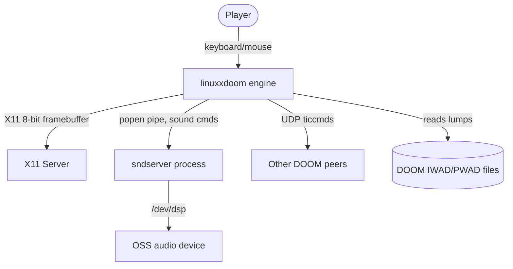
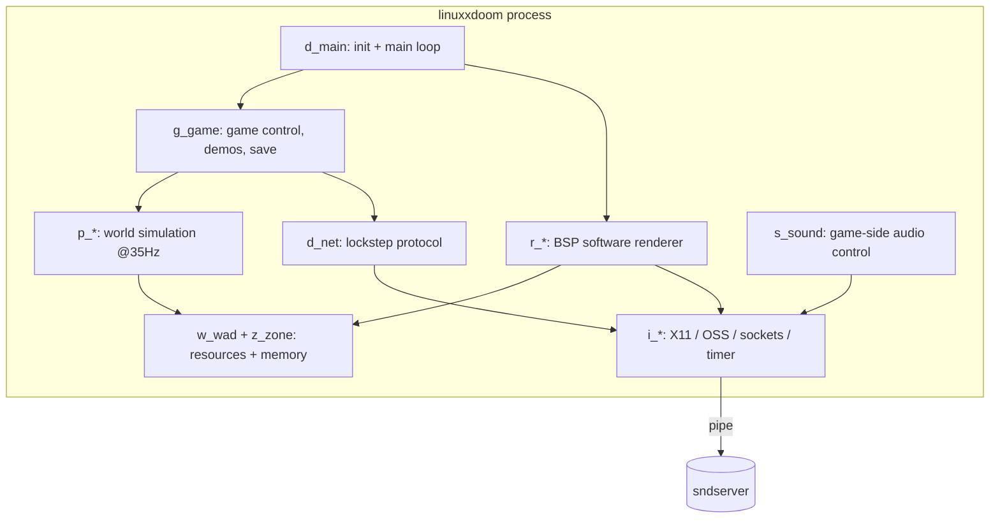
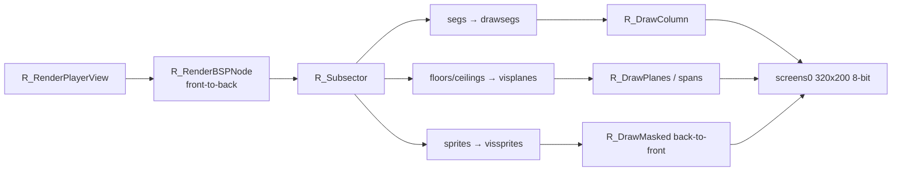
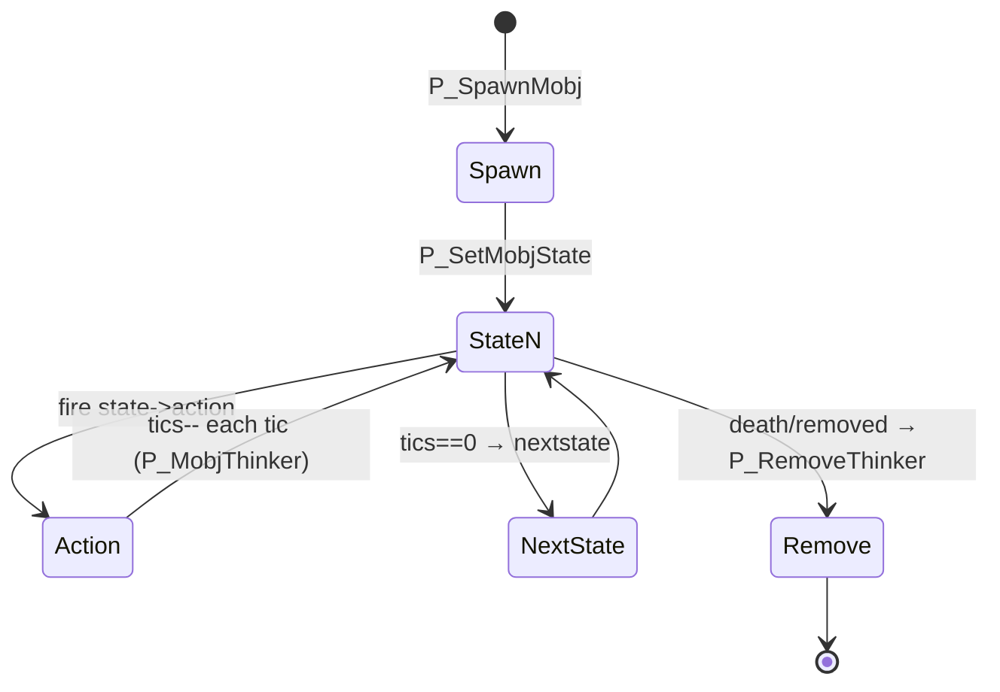

# DOOM (Linux 1.10) — Architecture Reference

> Onboarding reference for the id Software DOOM source release. Every non-obvious
> claim is cited to a local path (and line number where it pins something
> specific). Generated from the local checkout only.

---

## Part 1 — Whole-repo technical deep-dive

### What this repository is

This is the original id Software **DOOM** source code, as released on
December 23, 1997 by John Carmack (`README.TXT`), cleaned up by Bernd Kreimeier
so it compiles and runs on Linux. It is a **first-person shooter game engine**
written in C. The release "only compiles and runs on linux" — the DOS code and
the copyrighted DMX sound library could not be released (`README.TXT`). You
still need real DOOM WAD data files to run it.

The engine renders a pseudo-3D world with a software rasterizer using
BSP-tree-based visibility, runs a deterministic 35 Hz game simulation, and
supports peer-to-peer lockstep multiplayer.

### Tech-stack detection table

| Layer | Technology | Evidence (file+line) |
|---|---|---|
| Language | C (ANSI C, "Emacs C++ mode" headers but compiled as C) | `linuxdoom-1.10/Makefile:9` (`CC=gcc`), file headers e.g. `d_main.c:1` |
| Build | GNU Make + gcc | `linuxdoom-1.10/Makefile:11` (`CFLAGS=-g -Wall -DNORMALUNIX -DLINUX`) |
| Windowing/Video | X11 (Xlib) + optional MIT-SHM (XShm) | `i_video.c:20-40`; `Makefile:14` (`LIBS=-lXext -lX11 -lnsl -lm`) |
| Audio | OSS `/dev/dsp` via a separate sound-server process | `i_sound.c:61-78`, `i_sound.c:741-755`; `sndserv/linux.c:30-56` |
| Networking | BSD UDP sockets (Linux); DOS IPX / serial drivers (external) | `i_net.c:30-50`, `i_net.c:90-120`; `ipx/IPXNET.C`, `sersrc/SERSETUP.C` |
| Framebuffer | 320×200, 8-bit paletted (`PseudoColor`) | `i_video.c:769-772`, `i_video.c:853-907` |
| Fixed-point math | 16.16 fixed-point (`fixed_t`, `FRACBITS`) | `m_fixed.c`, `r_main.c:201-210` |
| Version | `VERSION = 110` | `linuxdoom-1.10/doomdef.h:33` |

### Entry points

- **Executable entry:** `i_main.c` — `main()` captures `argc/argv` into
  `myargc/myargv` and calls `D_DoomMain()` (`i_main.c:33-45`).
- **High-level driver:** `D_DoomMain()` in `d_main.c:794-1113` — identifies the
  game version, parses args, initializes every subsystem, then enters the main
  loop `D_DoomLoop()` (loop body at `d_main.c:354-406`).
- **External deployables:** `sndserv/` (Linux sound server binary,
  `sndserv/Makefile`), `ipx/` and `sersrc/` (DOS-only network/serial driver
  launchers).

### Commands & Verification Inventory

There is **no test suite, linter, formatter, typecheck, CI config, or task
runner** anywhere in the repository — only `make`. This is a 1997 source drop.
This inventory is the source of truth for downstream planning.

| Command | Purpose | Evidence |
|---|---|---|
| `cd linuxdoom-1.10 && make` | Build the Linux X11 game binary → `linux/linuxxdoom` | `linuxdoom-1.10/Makefile:76-83` (`all: $(O)/linuxxdoom`) |
| `make clean` | Remove object files and build output | `linuxdoom-1.10/Makefile:85-87` |
| `cd sndserv && make` | Build the sound server → `linux/sndserver` | `sndserv/Makefile:9-32` |
| (build IPX driver) | DOS-only; no Linux build path | `ipx/` — DOS real-mode C, no portable Makefile |
| (build serial driver) | DOS-only; no Linux build path | `sersrc/` — DOS real-mode C |
| Run | `./linux/linuxxdoom` (requires a real DOOM IWAD present) | `README.TXT`; `d_main.c:817-870` (IWAD detection) |
| Test | **[UNVERIFIED — none exists]** No test target, no test files | Confirmed absent: no `*_test.*`, no `test/` dir |
| Lint / Format / Typecheck | **[NONE]** Only `gcc -Wall` warnings | `Makefile:11` |
| CI | **[NONE]** No `.github/`, `.gitlab-ci.yml`, `.travis.yml`, etc. | Confirmed absent from checkout |

> **Note — build will not succeed unmodified on a current toolchain.** The
> Makefile targets a mid-1990s Linux/libc/X11 environment (`-DNORMALUNIX
> -DLINUX`, `-L/usr/X11R6/lib`). This is the crux of the feasibility spike in
> the modernization plan.

### Directory layout

| Directory | Purpose |
|---|---|
| `linuxdoom-1.10/` | The engine itself — 62 `.c` and 62 `.h` files (~55k LOC). All game, render, and platform code. |
| `sndserv/` | Standalone Linux sound-server process (`/dev/dsp` playback), spawned by the game via `popen` |
| `ipx/` | DOS real-mode IPX network driver + `IPXSETUP` launcher (`ipx/README`) |
| `sersrc/` | DOS real-mode serial/modem driver + `SERSETUP` launcher (`sersrc/README.TXT`) |
| repo root | `README.TXT` (Carmack's release notes), `LICENSE.TXT` (GPLv2) |

### Source-file naming convention (engine)

DOOM uses a strict **module-prefix** convention; the prefix identifies the
subsystem and is the fastest way to navigate the tree:

| Prefix | Subsystem | Examples |
|---|---|---|
| `d_` | Main/driver, top-level control | `d_main.c`, `d_net.c` |
| `g_` | Game logic / control flow | `g_game.c` |
| `p_` | Playsim (world simulation) | `p_mobj.c`, `p_map.c`, `p_enemy.c`, `p_tick.c` |
| `r_` | Renderer (software rasterizer) | `r_main.c`, `r_bsp.c`, `r_segs.c`, `r_things.c` |
| `i_` | Platform/OS interface ("implementation") | `i_video.c`, `i_sound.c`, `i_net.c`, `i_system.c` |
| `m_` | Miscellaneous / utility | `m_fixed.c`, `m_random.c`, `m_menu.c`, `m_argv.c` |
| `w_` | WAD file access | `w_wad.c` |
| `z_` | Zone memory allocator | `z_zone.c` |
| `s_` | Sound control (game-side) | `s_sound.c` |
| `st_`, `hu_`, `wi_`, `f_`, `am_` | Status bar, HUD, intermission, finale, automap | `st_stuff.c`, `hu_stuff.c`, `wi_stuff.c`, `f_finale.c`, `am_map.c` |
| `v_` | Video buffer (paletted screen blit) | `v_video.c` |

### Data / storage, APIs, jobs, testing

- **Data storage:** All game content lives in **WAD files** (id's archive
  format). `w_wad.c:141-220` loads IWAD/PWAD files, reads the lump directory,
  and supports PWAD override (later lumps shadow earlier — backward scan in
  `W_CheckNumForName`, `w_wad.c:521+`). Save games are raw struct dumps with
  pointer→index swizzling (`p_saveg.c`).
- **Memory:** Custom **Zone allocator** (`z_zone.c`) — one big heap carved from
  `I_ZoneBase()`, with purgeable tags (`PU_*`) so cached lumps can be evicted
  under memory pressure (`z_zone.c:177-289`).
- **"APIs":** Internal only — the `i_*` layer is the platform API boundary.
- **Background jobs:** The **sound server** is a separate process (the only
  concurrency in the Linux build), fed sound commands over a `popen` pipe
  (`i_sound.c:741-755`).
- **Testing:** None.

---

## Part 2 — Context & ecosystem

### Local checkout identity

| Property | Value |
|---|---|
| Remote | `https://github.com/id-Software/DOOM.git` (`git remote -v`) |
| Branch | `master` |
| HEAD | `a77dfb96cb91780ca334d0d4cfd86957558007e0` — "Add GPL information", Mike Rubits, 2024-01-16 |
| Engine version | `110` (`doomdef.h:33`) |
| License | **GPLv2** (`LICENSE.TXT`) |

> **[Resolved contradiction — license]** Individual source headers say "only
> under the terms of the DOOM Source Code License" (e.g. `d_main.c:6-14`). The
> repository was **relicensed to GPLv2** — `LICENSE.TXT` is the GNU GPL v2, and
> the most recent commit is literally "Add GPL information" (2024). The GPL is
> authoritative; the in-file headers are historical.

> **[Resolved contradiction — file manifest]** `linuxdoom-1.10/FILES` and
> `FILES2` list many platform files (`i_ibm.c`, `i_x.c`, `i_dga.c`,
> `i_svgalib.c`, `planar.asm`, `tmap.S`, etc.) that are **not present** in this
> checkout. The actual build source set is defined by `linuxdoom-1.10/Makefile`
> `OBJS` (`Makefile:22-73`) and uses the Linux `i_*.c` files only
> (`i_main.c i_net.c i_sound.c i_system.c i_video.c`). Trust the Makefile, not
> `FILES`.

### Repo-specific contributor docs

- `README.TXT` — Carmack's release notes and "project ideas" (port it, add
  rendering features, 3D-accelerate it). No coding standards.
- `linuxdoom-1.10/ChangeLog` — Bernd Kreimeier's 1997 cleanup log (e.g.
  "enabled SNDSERV" — `ChangeLog:15`). No `CONTRIBUTING`, `AGENTS.md`, or
  `.github/` present.

### Developer gotchas

- **Won't build as-is on a modern box.** Assumes libc5-era Linux, X11 in
  `/usr/X11R6`, `-lnsl`, and 8-bit `PseudoColor` X visuals (`i_video.c:769-772`)
  which no modern display server provides.
- **Requires proprietary data.** The engine is useless without a real DOOM IWAD
  (`README.TXT`); the IWAD identifies game mode (shareware/registered/commercial)
  at startup (`d_main.c:817-870`).
- **Global mutable state everywhere.** The engine is single-threaded with
  hundreds of file-scope globals; there is no dependency injection or
  encapsulation boundary except the `i_*` naming convention.
- **8.3 uppercase filenames in DOS dirs.** `ipx/` and `sersrc/` use DOS
  conventions (`DOOMNET.C`, `IPXNET.C`).
- **The assembly is dead in this build.** `-DUSEASM` is commented out
  (`Makefile:11`); `FILES2` marks `tmap.S` "currently unused". The C paths in
  `r_draw.c` are what actually run.

### Ecosystem relationships (visible from disk)

Three **separately-deployable** components beyond the engine:

1. `sndserv/sndserver` — Linux audio process, IPC via pipe (`i_sound.c:741-755`).
2. `ipx/` — DOS IPX driver; hooks an interrupt vector and spawns DOOM with a
   `doomcom` shared-struct address on the command line (`ipx/DOOMNET.C:55-61`).
3. `sersrc/` — DOS serial/modem driver, same `doomcom` launch pattern
   (`sersrc/DOOMNET.C:14-73`).

The **`doomcom_t` shared struct** is the contract between the engine and any
network driver (`d_net.c:44-45`).

---

## Part 3 — Architectural blueprint

### Layering & dependency rules

DOOM is a **single-process, single-threaded game loop** with an informal but
consistent layering enforced only by the module-prefix convention:

```
  i_*  (platform: X11, OSS, sockets, timer)   ← only layer that touches the OS
   ↑
  r_*  renderer      s_*/i_sound  audio      d_net/i_net  netcode
   ↑                      ↑                        ↑
  p_*  playsim (world simulation, deterministic)
   ↑
  g_*  game control (episodes, demos, save/load)
   ↑
  d_main  driver / main loop
```

The **rule that matters**: only `i_*` files may call OS APIs. Everything above
is platform-independent and talks to the OS exclusively through the `i_*`
interface (`i_system.h`, `i_video.h`, `i_sound.h`, `i_net.h`). This is what
made the engine portable (`README.TXT`: "the code is quite portable").

### C4 Level 1 — System context



### C4 Level 2 — Containers / major subsystems



### C4 Level 3 — One frame / one tic lifecycle

```mermaid
sequenceDiagram
  participant Loop as D_DoomLoop (d_main.c:354)
  participant Net as NetUpdate/G_Ticker
  participant Sim as P_Ticker (p_tick.c:130)
  participant Think as P_RunThinkers (p_tick.c:101)
  participant Rend as R_RenderPlayerView (r_main.c:870)
  participant Vid as I_FinishUpdate (i_video.c)

  Loop->>Net: gather ticcmds (local/net/demo), consistency check
  Net->>Sim: G_Ticker → P_Ticker (advance 1 tic, 35Hz)
  Sim->>Think: run thinker list (mobj movement, AI, specials)
  Loop->>Rend: D_Display → R_RenderPlayerView
  Rend->>Rend: BSP walk → segs → planes → sprites into screens[0]
  Rend->>Vid: blit 320x200 8-bit buffer to X11
```

### Cross-cutting concerns

| Concern | Location | Evidence |
|---|---|---|
| Timing (35 Hz tics) | `I_GetTime()` via `gettimeofday()` | `i_system.c:85-100`; `TICRATE=35` `doomdef.h:122` |
| Config / args | `m_argv.c` (`M_CheckParm`), defaults in `m_misc.c` | `m_argv.c:21-43`; `d_main.c:808-810` |
| Config file | `M_LoadDefaults` (`.doomrc`-style) | `d_main.c:1010+`; `m_misc.c` |
| Logging / errors | `I_Error()` (printf + exit), `printf` banners | `i_system.c`; `d_main.c:1064-1089` |
| Memory | Zone allocator with purge tags | `z_zone.c:177-289` |
| Endianness | `SwapSHORT/SwapLONG` for portable WAD reads | `m_swap.c:34-52` |
| Determinism (RNG) | fixed 256-entry `rndtable[]` | `m_random.c:18-66` |
| Secrets / auth | none (single-player local, trusted LAN peers) | — |
| Feature flags | compile-time `#define` (`SNDSERV`, `USEASM`, `RANGECHECK`) | `Makefile:11`; `i_sound.c:61-78` |

### Inferred ADRs (reconstructed from code)

**ADR: BSP-tree software rendering with fixed-point math**
- Context: 1993 hardware, no FPU guarantee, must render pseudo-3D fast.
- Decision: precompute a BSP tree per level; render front-to-back walls, then
  floors/ceilings (visplanes), then sprites; all math in 16.16 fixed-point.
- Consequences: deterministic, fast on integer CPUs; but flat-only floors, no
  room-over-room, non-power-of-two texture pain (`README.TXT`).

**ADR: 35 Hz deterministic simulation decoupled from render rate**
- Context: lockstep netplay and demo recording need identical simulation on
  every machine.
- Decision: fixed 35 Hz tic; simulation driven solely by `ticcmd_t` streams;
  RNG is a fixed table (`m_random.c`).
- Consequences: demos/netgames are reproducible; any nondeterminism (float,
  uninitialized memory) desyncs. Render can interpolate but sim cannot vary.

**ADR: peer-to-peer lockstep networking**
- Context: small-N LAN multiplayer in 1993.
- Decision: every peer exchanges `ticcmd_t` for every tic and runs the identical
  simulation; consistency checked by checksum (`d_net.c`).
- Consequences: latency = slowest peer; no server authority; desync is fatal.

**ADR: platform isolation via `i_*` layer**
- Context: port from DOS to many OSes.
- Decision: confine all OS calls to `i_*` files behind narrow headers.
- Consequences: porting = rewrite ~5 files; the other ~57 stay untouched.

**ADR: separate sound-server process**
- Context: synchronous and timer-driven audio "did not work well" on Linux.
- Decision: spawn a child `sndserver` and stream commands over a pipe
  (`sndserv/README.sndserv:2-10`; `i_sound.c:741-755`).
- Consequences: audio glitches isolated from the game loop; adds a second
  deployable and a fragile pipe protocol.

### Governance & enforcement

None automated. No CI, no CODEOWNERS, no tests, no linters. Correctness was
historically validated by **demo compatibility** (a recorded `ticcmd_t` stream
must replay identically) — the strongest behavioral oracle this engine has.

### How to add a feature (historical workflow)

1. Add game logic under the correct prefix (`p_*` for simulation, `r_*` for
   rendering).
2. If it touches the OS, route through the `i_*` layer only.
3. Preserve tic determinism — no floats, no uninitialized reads, or demos/net
   desync.
4. Rebuild with `make`; validate by replaying a known demo (the de-facto test).

**Common pitfalls:** breaking demo/net determinism; assuming a non-8-bit
framebuffer; forgetting Zone purge semantics; byte-order bugs in WAD structs.

---

## Subsystem deep-dives

### 1. The software renderer (`r_*`)

The renderer turns the player's viewpoint into a 320×200 8-bit frame each
display update via `R_RenderPlayerView()` (`r_main.c:870-898`).

**Pipeline (in order):**
1. `R_SetupFrame()` snapshots view state — `viewx/y/z`, `viewangle`,
   `viewcos/sin`, `fixedcolormap`, `extralight` (`r_main.c:830-863`).
2. **BSP walk** — `R_RenderBSPNode()` recurses the level's BSP tree, rendering
   the near child first and pruning the far child via `R_CheckBBox()` against the
   `solidsegs` clip list (front-to-back, `r_bsp.c:552-578`, `r_bsp.c:381-487`).
3. **Walls (segs)** — each subsector's segs go through `R_AddLine()` →
   solid/pass clipping → `R_StoreWallRange()`, recorded as `drawsegs`
   (`r_bsp.c:259-355`).
4. **Floors/ceilings (planes)** — accumulated into `visplanes`, drawn by
   `R_DrawPlanes()` using horizontal spans (`r_plane.c:51-61`, `:367-453`).
5. **Sprites (things)** — projected into `vissprites`, depth-sorted, drawn
   back-to-front by `R_DrawMasked()` after solid geometry (`r_things.c:289-335`,
   `:787-986`).

**Core primitive:** `R_DrawColumn()` writes one vertical textured column into
`screens[0]` at `ylookup[dc_yl] + columnofs[dc_x]`, stepping by `SCREENWIDTH`,
advancing a fixed-point texture coordinate `frac += dc_iscale` (`r_draw.c:105-147`).
Everything (projection, texture stepping, lighting distance) is 16.16
fixed-point.

**Lighting:** `colormaps` is a WAD lump of shade tables; `R_InitLightTables()`
builds `zlight[light][dist]` and `scalelight[][]` from it (`r_main.c:608-642`,
`:743-759`). A column/span picks its colormap by distance; `I_SetPalette()`
uploads the 256-color palette (gamma-corrected) into the X colormap
(`i_video.c:538-585`).



### 2. The playsim & thinker/state machine (`p_*`, `g_*`, `info.c`)

The simulation advances exactly one tic per `P_Ticker()` call at 35 Hz
(`p_tick.c:130-157`; `TICRATE` `doomdef.h:122`). Input arrives as `ticcmd_t`
(`forwardmove`, `sidemove`, `angleturn`, `buttons`, `consistancy` —
`d_ticcmd.h:18-26`), synthesized locally by `G_BuildTiccmd()` (`g_game.c:237-403`)
or read from the net/demo stream, then dispatched in `G_Ticker()`
(`g_game.c:605-730`).

**Thinker system** — the beating heart. `thinker_t` is a doubly-linked node with
a function pointer (`d_think.h:54-67`). `thinkercap` is the sentinel
(`p_tick.c:47-55`); `P_RunThinkers()` walks the list every tic, deleting nodes
lazily marked with function `-1`, otherwise invoking each `actionf_p1`
(`p_tick.c:101-125`). Every active map object is a thinker via `P_MobjThinker`
(`p_mobj.c:477-531`).

**Actor state machine** — behavior is table-driven. `state_t` holds
`{sprite, frame, tics, action, nextstate}`; `mobjinfo_t` holds each actor
type's spawn/see/pain/death states, health, speed, and flags; both tables live
in `info.c`/`info.h` (`info.h:174-1158`, `:1163-1333`). `P_SetMobjState()` loads
a state, sets the sprite/frame/tics, and immediately fires the state's action
function; zero-tic states chain instantly (`p_mobj.c:48-78`). `P_MobjThinker()`
counts down `tics` and advances to `nextstate` (`p_mobj.c:435-455`). Monster AI
(`A_Chase`, etc.) is just state actions calling `P_SetMobjState` with
`seestate/meleestate/missilestate` (`p_enemy.c:672-776`).

**Collision** — blockmap-accelerated. `P_CheckPosition()` bounds-boxes the mover
and iterates nearby things/lines via `P_BlockThingsIterator` /
`P_BlockLinesIterator` (`p_map.c:375-441`); `P_TryMove()` enforces fit/step/
dropoff rules and fires crossed line specials (`p_map.c:451-536`). Wall sliding
is `P_SlideMove()` — trace, find best intercept, reproject remaining momentum
along the line (`p_map.c:687-784`). The geometric kernel (`P_PointOnLineSide`,
`P_InterceptVector`, `P_PathTraverse`) is in `p_maputl.c`. This is the
"polar-coordinate clipping" Carmack regrets in `README.TXT`.

**Determinism** — RNG is the fixed 256-byte `rndtable[]` walked by `P_Random()`
(`m_random.c:18-66`); identical `ticcmd_t` input + identical RNG ⇒ identical
simulation, which is what makes demos and lockstep netplay reproducible.



### 3. Resources & memory (`w_wad.c`, `z_zone.c`)

All content is in **WAD** archives. `W_InitMultipleFiles()`/`W_AddFile()` open
each IWAD/PWAD, validate the `IWAD`/`PWAD` header, read the lump directory, and
append entries to a growing `lumpinfo` table (`w_wad.c:141-220`). Lumps are
cached lazily: `W_CacheLumpNum()` `Z_Malloc`s, reads the lump, then
`Z_ChangeTag`s it purgeable (`w_wad.c:473-500`). Name lookup scans **backwards**
so later PWADs override earlier lumps — the entire modding model
(`W_CheckNumForName`, `w_wad.c:521+`).

The **Zone allocator** carves one heap from `I_ZoneBase()` (`z_zone.c:67-116`).
Every block carries a `PU_*` purge tag; `Z_Malloc` can evict purgeable blocks to
satisfy an allocation, and rejects ownerless purgeable requests
(`z_zone.c:177-289`). `Z_FreeTags` bulk-frees a tag range at level teardown
(`z_zone.c:294-317`). Endianness is handled at read time via `m_swap.c:34-52`.

---

## Confidence assessment

| Claim area | Rating | Notes |
|---|---|---|
| Tech stack (C/X11/OSS/UDP) | **High** | Makefile + source `#include`s |
| Build commands | **High** | Only `make`; verified no other runner exists |
| No tests/CI/lint | **High** | Exhaustively confirmed absent from checkout |
| Renderer pipeline | **High** | Cited across `r_main/bsp/segs/plane/things/draw` |
| Playsim/thinker/state machine | **High** | Cited across `p_tick/mobj/map/enemy`, `info.*` |
| WAD + Zone memory | **High** | Cited `w_wad.c`, `z_zone.c` |
| Networking (lockstep) | **Inferred/High** | `d_net.c`/`i_net.c` cited; live desync behavior not run |
| DOS drivers (ipx/sersrc) | **Inferred** | Read source; cannot build/run DOS real-mode here |
| "Won't build on modern toolchain" | **Inferred** | Strong from Makefile/X11/8-bit assumptions; not executed |
| Demo determinism as oracle | **Inferred** | Design intent from RNG table + ticcmd model |

---

## Footnotes — key local files

- `README.TXT` — Carmack's 1997 release notes; project intent and known flaws.
- `LICENSE.TXT` — GPLv2 (authoritative license).
- `linuxdoom-1.10/Makefile` — the real build definition and source set.
- `linuxdoom-1.10/doomdef.h` — `VERSION`, `TICRATE`, core constants.
- `linuxdoom-1.10/d_main.c` — init sequence + main loop.
- `linuxdoom-1.10/i_main.c` — `main()` entry.
- `linuxdoom-1.10/r_main.c`, `r_bsp.c`, `r_draw.c` — renderer core.
- `linuxdoom-1.10/p_tick.c`, `p_mobj.c`, `p_map.c`, `info.c` — playsim core.
- `linuxdoom-1.10/w_wad.c`, `z_zone.c` — resources + memory.
- `linuxdoom-1.10/d_net.c`, `i_net.c` — lockstep netcode.
- `linuxdoom-1.10/i_video.c`, `i_sound.c`, `i_system.c` — platform layer.
- `sndserv/`, `ipx/`, `sersrc/` — external deployables.
