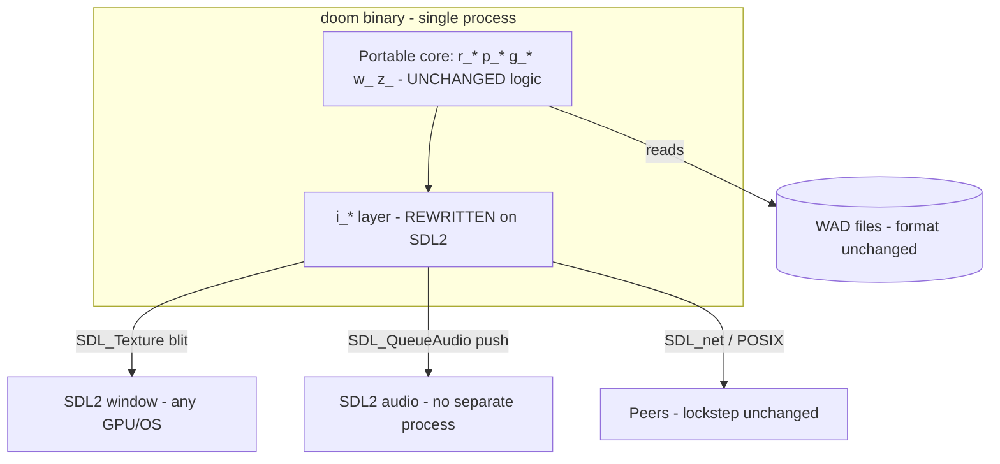

# DOOM Modernization Plan

> Forward-looking action plan. Current-state facts are cited to `ARCHITECTURE.md`
> rather than restated. This plan is **opinionated** and **adaptive**: the legacy
> toolchain is dead, so safety is anchored at behavioral seams and a demo-replay
> oracle — not at a resurrected green legacy CI gate.

---

## 1. Executive summary

**What:** Bring the 1997 Linux DOOM 1.10 source (`ARCHITECTURE.md` Part 1) up to
a buildable, runnable, maintainable state on a modern 64-bit toolchain, with a
cross-platform SDL2 backend replacing the dead X11/OSS/`popen`-sndserver
platform layer — while **preserving demo/netgame determinism** and the WAD data
contract.

**Why:** The engine will not compile today. The feasibility spike (§3) shows it
dies on the first modern-incompatible header (`values.h`) and depends on
libc5-era X11 8-bit `PseudoColor` visuals and OSS `/dev/dsp` that no current
system provides (`ARCHITECTURE.md` "Developer gotchas"). Critically, the spike
also shows the **damage is contained**: the portable game logic (`r_*`, `p_*`,
`g_*`, `w_`, `z_`) is near-compilable, and every OS dependency is confined to
the `i_*` layer exactly as designed.

**Rough scope:** This is **~90% a porting/rewrite of ~5 platform files plus a
64-bit-correctness pass**, and **~10% touching the portable core** (only where
32-bit/pointer assumptions leak in). It is emphatically **not** a rewrite of the
renderer or playsim — those stay. Estimated shape: one beachhead phase to first
runnable frame, then incremental hardening. The DOS `ipx/` and `sersrc/` drivers
are **descoped to archive** (§4).

---

## 2. Current state assessment

See `ARCHITECTURE.md` for the full audited picture. The load-bearing facts for
this plan:

- **Stack:** C, GNU Make + gcc, X11/XShm video, OSS audio via a separate
  `sndserver` process, BSD UDP lockstep netcode (`ARCHITECTURE.md` tech-stack
  table).
- **No tests, no CI, no linter, no formatter** — only `make`
  (`ARCHITECTURE.md` Commands & Verification Inventory).
- **Platform isolation is real and clean:** only `i_*` files touch the OS
  (`ARCHITECTURE.md` "Layering & dependency rules"). X11 lives only in
  `i_video.c`; OSS only in `i_sound.c`; sockets only in `i_net.c`; timing only
  in `i_system.c`.
- **Determinism is the crown jewel:** 35 Hz tics + fixed RNG table + `ticcmd_t`
  streams make demos and netplay reproducible (`ARCHITECTURE.md` ADR + playsim
  deep-dive). This is our behavioral oracle.
- **Data contract:** WAD lump format and 320×200 8-bit paletted framebuffer are
  stable, externally observable seams (`ARCHITECTURE.md` WAD deep-dive).
- **Three external deployables** beyond the engine; two (`ipx/`, `sersrc/`) are
  DOS real-mode and unbuildable/irrelevant today.

---

## 3. Feasibility spike result & strategy

### 3.1 Spike (time-boxed, executed)

Ran `make` on the checkout with Apple clang 21 (`gcc` → clang shim).
**Observed, not assumed:**

| Probe | Result |
|---|---|
| Compiler available | ✅ clang 21 present |
| First TU compiles | ✅ `doomdef.c` compiled (only an unused-`rcsid` warning) |
| Dependency install from lockfile | N/A — no package manager; deps are system headers/libs |
| Native/build succeeds on current toolchain | ❌ **fails at `doomtype.h:42` → `#include <values.h>` file not found** |
| Boots / runs | ❌ never reached |
| Test runner executes | ❌ **no test runner exists at all** |

**Porting-surface measurements (quantified, not guessed):**

- `values.h` referenced in **2 files only** — a libc5-era header dropped from
  modern glibc/musl/macOS; mechanical fix (`<limits.h>`/`<float.h>` +
  `MAXINT`/`MINSHORT` shims).
- **X11** confined to **`i_video.c` (1 file)**.
- **OSS `/dev/dsp`** confined to **`i_sound.c` (1 file)**.
- **XShm (`sys/shm.h`)** confined to **`i_video.c`**.
- Pointer/`int` size assumptions present (10+ `(int)` casts in `i_video.c`) →
  a real **64-bit correctness** risk in the portable core (`fixed_t`, WAD
  offsets, pointer swizzling in `p_saveg.c`).

**Verdict:** The toolchain is **dead but the corpse is *nearly* warm** — it
compiles until it hits a handful of removed headers and one platform file each
for video/audio/net. This is the *lucky-ish* middle: the **portable core can be
resurrected cheaply**, but the **platform layer must be rewritten** (X11 8-bit
PseudoColor and OSS are not merely old, they're *gone*).

### 3.2 Migration strategy (A/B fork) — per component

| Component | Strategy | Rationale |
|---|---|---|
| **Portable core** (`r_*`, `p_*`, `g_*`, `m_*`, `w_wad`, `z_zone`, `info`, `s_sound`, `st_/hu_/wi_/f_/am_`) | **A — Freeze-then-lift** | It *almost* compiles; net it with characterization + demo replay, then fix 64-bit/header issues under the net. |
| **Platform layer** (`i_video`, `i_sound`, `i_net`, `i_system`, `i_main`) | **B — Beachhead / walking skeleton** | X11-8bit/OSS are dead; don't resurrect them. Drive a thin SDL2 slice onto the modern stack until a frame renders. |
| **`sndserv/`** (separate process) | **B → collapse** | The separate-process audio hack existed to work around 1997 Linux audio (`ARCHITECTURE.md` sound ADR). Replace with in-process SDL2 audio; retire the second deployable. |
| **`ipx/`, `sersrc/`** (DOS drivers) | **L0 — archive** | DOS real-mode, unbuildable, superseded by UDP `i_net`. Keep as historical reference; do not port. |

### 3.3 Testability Milestone — per component

**"Testable" is an *output* here, not a precondition.** The whole engine is one
process, so testability arrives together for the core once it builds and boots:

| Component | Testability Milestone lands at | Notes |
|---|---|---|
| Portable core + SDL2 platform | **End of Phase 2** (first runnable frame on modern toolchain) | First point it builds 64-bit-clean, boots, loads a WAD, and can replay a demo = ≥1 meaningful passing check |
| Audio (SDL2) | **Phase 4** ✅ | Landed: in-process SDL push audio; game ran silent before it. Non-blocking; core untouched (demo-parity green). |
| Netcode | **Phase 5** ✅ | Landed: portable POSIX BSD-sockets transport; 2-proc 127.0.0.1 loopback consistency test green (self-frozen `e8ca533e8baf4ad4`). Sim untouched (demo `a00552bbf22274a2` unchanged). |
| `ipx/`/`sersrc/` | **Never (archived)** | L0 by decision |

**The single most important marker in this plan: the core crosses its
Testability Milestone at the end of Phase 2.** Phases 0–2 are therefore
**pre-testability ("dark")**; Phases 3+ are **post-testability ("lit")**.

### 3.4 Safety ladder — chosen rung per component + residual-risk register

| Component | Target rung | Residual risk (named) | Closes at |
|---|---|---|---|
| Portable core | **L2 → L4** | Dark until Phase 2. Reached L3 at Phase 2 (self-frozen demo-parity + exact frame-hash + palette-lut green under `ctest`). **Reached L4 at Phase 3** — full parity gate green in CI on **Linux + macOS** (first verified Linux build; byte-exact frame-hash agrees cross-platform). Residual: master is self-referential + demo-bounded coverage (unchanged — the oracle is self-frozen by design). | ✅ Phase 3 |
| SDL2 platform layer | **L1 → L3** | No pixel-exact test for a *new* backend; rely on frame-hash smoke + manual visual check until characterization harness exists. Phase 3 added full keyboard+mouse input and a documented manual interactive-play checklist; `-Werror` holds the layer to zero warnings. | Phase 4 |
| Audio | **L1** | Audio correctness is perceptual; smoke checklist only. Low regression cost. **Reached L1 at Phase 4** — in-process SDL push audio (`i_sound_sdl.c`) under `-Werror`; parity+frame-hash stay green (sim untouched); device opens at 11025/2ch/S16, oracle modes suppress audio. Residual: no automated audio oracle (blessed downgrade — human perceptual run pending). | ✅ Phase 4 |
| Netcode | **L2** | Lockstep desync only reproducible with ≥2 peers; use recorded-demo consistency checksum as oracle. **Reached L2 at Phase 5** — `platform/posix/i_net_posix.c` (raw POSIX BSD-sockets, Linux+macOS) under `-Werror`; 2-proc 127.0.0.1 loopback `net-loopback` ctest asserts lockstep held (no consistency failure) + self-frozen 2-player checksum `e8ca533e8baf4ad4`; wire layout guarded by `_Static_assert`s + receive-side validation. Residual: loopback-only (single host, no real WAN/latency/loss; Windows/Winsock deferred); checksum is self-frozen (self-consistency only, per oracle strategy). | ✅ Phase 5 |
| DOS drivers | **L0** | Archived; zero users, zero regression cost. | (accepted, blessed) |

**Blessed downgrades:** Audio at L1 and DOS drivers at L0 are *first-class
outcomes*, not failures — their regression cost is ~zero (abandoned code / no
users, per the economic triage below).

### 3.5 Oracle & economic triage

- **Best oracle available — the game *runs somewhere*:** dozens of faithful
  DOOM source ports (and original binaries) exist and can produce **reference
  demo recordings and reference frame captures**. We do **not** need to resurrect
  the 1997 binary — a known-good demo LMP + a reference frame render is a
  stronger, cheaper oracle than any unit test on dead code.
- **The durable seams** (survive any rewrite): WAD lump format, `ticcmd_t`
  protocol (`d_ticcmd.h`), 320×200 8-bit framebuffer + palette, savegame layout.
  Pin *these*, not internal functions.
- **Economic call:** This is abandoned, zero-user, zero-liability code. An
  expensive full L4 gate *up front* would be over-engineering. We invest in the
  demo-replay oracle (cheap, high-signal) and let CI grow to L4 only *after* the
  engine boots.

---

## 4. Target architecture

**Decision-framework order applied (least→most disruptive; stop at first that
works).** Bias toward conservatism: the renderer and playsim are *kept*.

### What stays vs. what goes

| Component | Verdict | Framework level |
|---|---|---|
| Renderer `r_*` (BSP, segs, planes, things, draw) | ✅ **Keep** (fix 64-bit only) | 1 — upgrade in place |
| Playsim `p_*`, `g_game`, `info` | ✅ **Keep** (fix 64-bit only) | 1 — upgrade in place |
| WAD `w_wad`, Zone `z_zone` | ✅ **Keep** (fix pointer/size) | 1 — upgrade in place |
| Fixed-point `m_fixed`, RNG `m_random`, tables | ✅ **Keep as-is** | 0 — keep |
| Removed headers (`values.h` etc.) | ⬆️ **Upgrade** to `<limits.h>`/`<float.h>` | 1 — upgrade in place |
| `i_video.c` (X11/XShm 8-bit) | 🔁 **Rewrite** on SDL2 | 4 — rewrite (justified) |
| `i_sound.c` + `sndserv/` (OSS + `popen`) | 🔁 **Rewrite** to in-process SDL2_mixer/SDL audio | 4 — rewrite (justified) |
| `i_system.c` (timer/shutdown) | 🔀 **Swap** to SDL timer + portable stdio | 2/3 — swap/wrap |
| `i_net.c` (BSD sockets) | 🔀 **Swap** to SDL_net (or keep POSIX, guard Win32) | 2 — swap dependency |
| Build (`Makefile`) | ⬆️ **Upgrade** to CMake (cross-platform) | 1/2 |
| `ipx/`, `sersrc/` (DOS drivers) | 🗑️ **Remove/Archive** | 5 — remove |

### Recommended stack

- **Language:** stay C (C11) — rewriting the engine in another language is
  unjustified rewrite cost; "it's old" is not sufficient.
- **Platform backend:** **SDL2** — single dependency replacing X11 + XShm + OSS
  + the sound-server process, cross-platform (Linux/macOS/Windows), still
  low-level enough to keep the 8-bit paletted → 32-bit texture blit explicit.
- **Build:** **CMake** — cross-platform, finds SDL2, out-of-tree builds.
- **Netcode:** keep the lockstep model; wrap sockets behind SDL_net or a thin
  POSIX/Winsock shim (interface `i_net.h` unchanged).

### ADR: Adopt SDL2 as the single platform backend
- **Context:** X11 8-bit `PseudoColor` and OSS `/dev/dsp` are gone from modern
  systems; three platform files + a separate sound process are all dead.
- **Decision:** Rewrite the `i_*` layer against SDL2 (video/audio/timer/input)
  and SDL_net (optional). Level 4 (rewrite) — justified: the frameworks these
  files target are *removed*, not merely outdated.
- **Alternatives considered:** (a) Modern X11 truecolor — still Linux-only,
  rejected. (b) Raw Wayland/ALSA — more code, less portable, rejected.
  (c) Resurrect 8-bit X visuals via Xephyr — a museum piece, rejected.
- **Consequences:** One new dependency (SDL2). Cross-platform for free. The
  separate `sndserver` deployable disappears. Internal renderer output contract
  (320×200 8-bit + palette) is preserved and blitted to an SDL texture.

### ADR: CMake replaces the hand-written Makefile
- **Context:** The Makefile hard-codes `/usr/X11R6`, `-lnsl`, Linux paths.
- **Decision:** CMake with `find_package(SDL2)`; keep object layout simple.
  Level 1/2.
- **Alternatives:** Keep Make (Linux-only), Meson (fine, but CMake has wider
  reach for SDL). 
- **Consequences:** Cross-platform builds; a place to later add CI, warnings-as-
  errors, and a test target.

### ADR: Keep the BSP software renderer and playsim untouched
- **Context:** README invites a 3D-accelerated rewrite, but the software
  renderer works and is the reference behavior for demos.
- **Decision:** Keep them (Level 0/1). Only fix 64-bit correctness. A GPU
  renderer is a **future consideration**, not this plan.
- **Alternatives:** Rewrite renderer on OpenGL — huge risk, breaks demo/visual
  parity, rejected as scope fiction.
- **Consequences:** Preserves determinism and visual parity; keeps scope sane.

### Target architecture (Level 2 containers)

---

## 5. Per-feature migration analysis

### 5.1 Portable core (renderer + playsim + WAD/zone)
1. **Current:** BSP software renderer and 35 Hz deterministic playsim; near-
   compilable (`ARCHITECTURE.md` subsystem deep-dives 1–3).
2. **Strategy:** **A — Freeze-then-lift.** Tactic: Incremental Refactor under a
   demo-replay net.
3. **Testability:** crosses milestone at **Phase 2**; rung **L2→L4**.
4. **Coupling:** depends on `i_*` for video/timer; must build 64-bit-clean.
5. **Effort:** **M** (mostly header + 64-bit fixes, not logic).
6. **Risk:** silent 64-bit/pointer-size bugs corrupting sim → demo desync.
7. **Acceptance:** a known reference demo LMP replays to the **same end-of-demo
   consistency checksum** (seam oracle), and level geometry renders frame-hash-
   stable vs a reference capture.

### 5.2 Video backend (`i_video.c`)
1. **Current:** X11 + XShm, requires 8-bit PseudoColor (`ARCHITECTURE.md`
   renderer deep-dive §6).
2. **Strategy:** **B — Beachhead.** Tactic: Big-Bang rewrite of this one file on
   SDL2 (thinnest slice = "show one frame").
3. **Testability:** Phase 2 (dark until then); rung **L1→L3**.
4. **Coupling:** must honor the `I_FinishUpdate`/`I_SetPalette`/`screens[0]`
   contract so the renderer is unchanged.
5. **Effort:** **M**.
6. **Risk:** palette/gamma/blit differences vs original.
7. **Acceptance:** the 320×200 8-bit buffer + palette blits to an SDL texture;
   frame hash matches a reference capture within tolerance (smoke check).

### 5.3 Audio (`i_sound.c` + `sndserv/`)
1. **Current:** OSS `/dev/dsp`, mixed by a separate `sndserver` over a pipe
   (`ARCHITECTURE.md` sound ADR).
2. **Strategy:** **B — rewrite in-process** on SDL audio; retire `sndserv/`.
3. **Testability:** Phase 4; rung **L1** (perceptual, blessed downgrade).
4. **Coupling:** `s_sound.c` game-side stays; only `i_sound.*` changes.
5. **Effort:** **M**.
6. **Risk:** mixing/pitch drift; low regression cost.
7. **Acceptance:** SFX audibly play in sync via smoke checklist; no separate
   process remains.

### 5.4 Netcode (`i_net.c` + `d_net.c`)
1. **Current:** BSD UDP lockstep (`ARCHITECTURE.md` netcode deep-dive).
2. **Strategy:** **A/Swap** — keep `d_net.c` protocol; swap `i_net.c` transport
   to SDL_net or a POSIX/Winsock shim behind `i_net.h`.
3. **Testability:** Phase 5; rung **L2**.
4. **Coupling:** `doomcom_t`/`netbuffer` contract unchanged.
5. **Effort:** **S–M**.
6. **Risk:** endianness/packing on 64-bit; desync.
7. **Acceptance:** loopback 2-node game stays consistency-checksum-synced for a
   scripted demo.

### 5.5 Build system + headers
1. **Current:** Linux-only Makefile; `values.h` and friends removed.
2. **Strategy:** ⬆️ Upgrade to CMake; mechanical header swaps.
3. **Effort:** **S**.
4. **Acceptance:** `cmake --build` produces a binary on Linux **and** macOS.

### 5.6 DOS drivers (`ipx/`, `sersrc/`)
1. **Current:** DOS real-mode, interrupt-hooking, `doomcom` shared struct.
2. **Strategy:** 🗑️ **Archive** (L0). Superseded by UDP `i_net`.
3. **Acceptance:** moved under `legacy/` (or documented as unmaintained); build
   does not reference them.

---

## 6. Phased implementation plan

**Phase gating is regime-aware and applies to every phase.** A phase is not
complete until its Verification & Exit Criteria are **executed and recorded**,
and you do **not** advance until they pass. **Which criteria are valid depends on
the regime:** *lit* phases exit on runnable commands / green CI; *dark* phases
exit on the achievable safety-ladder rung (captured seam/oracle snapshots,
reversibility proven, smoke checklist) — **never** on a test suite the component
can't yet run. Report any phase whose pass/fail is unknown.

---

### Phase 0: Oracle & baseline capture (T-shirt size: S)

**Goal:** Capture the behavioral oracle *before* touching code.
**Regime:** pre-testability ("dark") — core doesn't build yet.
**Safety rung:** L2 (golden master captured). Residual risk: reference captures
come from a faithful port/original binary, not this exact tree — named and
accepted.
**Prerequisites:** none.
**Duration estimate:** <1 sprint.

#### Tasks
| ID | Task | Component | Blocked by |
|----|------|-----------|------------|
| 0.1 | Obtain a shareware DOOM IWAD + a known demo LMP | data | — |
| 0.2 | Record reference **end-of-demo consistency checksum** + a few **reference frame captures** from a trusted source port | oracle | 0.1 |
| 0.3 | Commit the seam contracts doc (WAD lump layout, `ticcmd_t`, framebuffer/palette, savegame) referencing `ARCHITECTURE.md` | oracle | — |

#### Risks & Mitigations
- **Risk:** wrong IWAD version changes demo behavior → **Mitigation:** pin IWAD
  name/size/checksum in the oracle doc.

#### Decisions made
- Oracle = demo-replay checksum + reference frame hashes (**decided**). Unit
  tests on legacy internals = **dropped** (they'd be deleted at rewrite).

#### Verification & Exit Criteria (Definition of Done)
- [ ] Reference demo checksum and ≥3 reference frame hashes captured and
      committed (dark-regime evidence — a captured seam/oracle snapshot).
- [ ] Seam-contract doc committed. No engine code changed (assert: purely
      additive).

---

### Phase 1: Make it compile 64-bit-clean (T-shirt size: M)

**Goal:** The portable core + a *stub* platform layer compile and link on a
modern 64-bit toolchain (no rendering yet).
**Regime:** pre-testability ("dark").
**Safety rung:** L1 (reversibility) — tiny commits, one fix per commit.
**Prerequisites:** Phase 0.
**Duration estimate:** 1–2 sprints.

#### Tasks
| ID | Task | Component | Blocked by |
|----|------|-----------|------------|
| 1.1 | Introduce CMake building the `OBJS` set (`ARCHITECTURE.md` inventory) | build | — |
| 1.2 | Replace removed headers (`values.h`→`<limits.h>`/`<float.h>` + `MAXINT`/`MININT` shims), the 2 offending files | core | 1.1 |
| 1.3 | Stub `i_video/i_sound/i_net/i_system` to no-op/log so the core links | platform | 1.1 |
| 1.4 | Fix 64-bit correctness: pointer↔int casts, `fixed_t`/`long` assumptions, WAD offset types, `p_saveg` swizzling | core | 1.2 |
| 1.5 | Compile with `-Wall -Wextra`; triage warnings that indicate real 64-bit/UB bugs | core | 1.4 |

#### Risks & Mitigations
- **Risk:** silent size/pointer bugs → **Mitigation:** enable
  `-Wpointer-to-int-cast`, `-Wint-to-pointer-cast`; keep commits atomic for
  bisect.
- **Risk:** scope creep into logic changes → **Mitigation:** rule — no behavior
  changes this phase, only portability.

#### Decisions made
- Language stays C11 (**decided**, ADR §4). SDL2 chosen as backend (**decided**)
  but *not wired yet* — stubs only this phase. GPU renderer = **deferred**
  (future consideration).

#### Verification & Exit Criteria (Definition of Done)
- [x] `cmake -B build && cmake --build build` links `./build/doom` on **macOS**
      (Apple clang 21). **Linux build deferred to Phase 3 CI** — named residual
      risk. Bonus (beyond the dark-regime gate): with a shareware IWAD present
      the binary boots through `R_Init`/`P_Init`/`D_CheckNetGame`/`S_Init` into
      the game loop under the stub platform layer.
- [x] Zero pointer/int-cast/narrowing size warnings remain, under `-Wall
      -Wextra -Wpointer-to-int-cast -Wint-to-pointer-cast -Wshorten-64-to-32`
      (recorded). Remaining warnings are pre-existing legacy noise
      (missing-field-initializers, unused-parameter, sign-compare) left
      untouched — out of portability scope.
- [x] Assert: no gameplay logic changed — only headers, types, build, and
      pointer-width/allocation fixes. Diff is portability-only (110/99 lines,
      24 files).
- [x] Residual risk: still no rendered frame — testability deferred to Phase 2.
      Linux build unverified locally (Phase 3 CI). Savegame on-disk format not
      preserved on LP64 (struct widening) — accepted, saves are not part of the
      demo oracle.

---

### Phase 2: Beachhead — first runnable frame (Testability Milestone) (T-shirt size: L)

**Goal:** Drive the thinnest end-to-end slice onto SDL2 until the engine boots,
loads a WAD, renders a frame, and **replays a demo to the reference checksum**.
**This phase crosses the core's Testability Milestone.**
**Regime:** pre-testability ("dark") *entering*, **post-testability ("lit")
*exiting*** — this is the crossover phase.
**Safety rung:** exits at **L3** (demo-replay parity green + frame-hash smoke;
audio/net still quarantined).
**Prerequisites:** Phase 1.
**Duration estimate:** 2–4 sprints.

#### Tasks
| ID | Task | Component | Blocked by |
|----|------|-----------|------------|
| 2.1 | Implement SDL2 `i_video.c`: create window/renderer/texture; blit 320×200 8-bit `screens[0]` via palette → 32-bit texture | video | — |
| 2.2 | Implement `i_system.c` timing on SDL (`I_GetTime` 35 Hz) + input events → DOOM keycodes | platform | 2.1 |
| 2.3 | Wire WAD load + `-playdemo` path so a demo runs headless-ish to completion | core | 2.2 |
| 2.4 | Add a **demo-parity test target**: run demo, compare end consistency checksum to the **self-frozen master** (recorded by our own v110 engine at the end of Phase 2 — see `docs/oracle/ORACLE_STRATEGY.md` Layer 3) | test | 2.3 |
| 2.5 | Add a **frame-hash smoke**: byte-**exact** hash of N indexed `screens[0]` frames vs the self-frozen frame master | test | 2.1 |

#### Risks & Mitigations
- **Risk:** palette/gamma blit mismatch → **Mitigation:** dedicated **palette-lut**
  gate asserting `I_SetPalette`'s exact index→ARGB8888 conversion (frame hashes
  cover the indexed drawer only, not the SDL LUT).
- **Risk:** input timing changes demo determinism → **Mitigation:** demo path
  must bypass real-time input; drive from the LMP `ticcmd` stream only
  (`-framehash` forces `singletics`; hashes sampled only outside active wipes).

#### Decisions made
- First slice = **`-playdemo` render-to-frame**, not interactive play
  (**decided** — smallest path that proves the seam). Interactive input polish =
  **deferred** to Phase 3. Audio = **deferred** to Phase 4 (game runs silent).

#### Verification & Exit Criteria (Definition of Done)
- [x] **LIT criterion (now valid):** `ctest -R demo-parity` **green** — the
      scripted v110 demo replays to the identical self-frozen canonical
      world-state checksum (`a00552bbf22274a2`), via a clean `-checkdemo` exit
      (exit 0 match / nonzero mismatch — never `I_Error`). Determinism preserved
      across the stub→SDL platform swap.
- [x] `ctest -R frame-smoke` **green** — byte-exact indexed `screens[0]` frame
      hash (`3e61b0f0c5dfd943`) matches the frozen master; built-in non-blank
      guard (≥8 distinct indices; observed 117) fails closed on a blank frame.
- [x] `ctest -R palette-lut` **green** — `I_SetPalette` index→ARGB8888
      conversion + gamma verified against PLAYPAL (256 entries).
- [x] Binary boots, loads the SHA-pinned IWAD (presented as `doom1.wad`), and
      renders a real frame — see boot-smoke evidence
      `docs/oracle/phase2-boot-frame.png` (3D view, status bar, HUD pickup msg).
- [x] Residual risk named: the golden master is **self-referential** (guarantees
      self-consistency of later refactors, not first-boot correctness) and its
      coverage is **bounded by the scripted demo** (see `tools/gen_demo.py`
      coverage notes); real-window screenshot is infeasible in the headless dev
      session (documented — boot-smoke uses the non-blank guard + committed
      PGM/PNG); audio (stub, L1 → Phase 4) and net (stub → Phase 5) still
      quarantined; Linux build unverified locally (Phase 3 CI).

---

### Phase 3: CI + interactive play + full parity gate (T-shirt size: M)

**Goal:** Stand up CI now that the engine is *lit*, and reach interactive
playability.
**Regime:** post-testability ("lit").
**Safety rung:** **L4** for the core (green CI: build + demo-parity + frame smoke).
**Prerequisites:** Phase 2.
**Duration estimate:** 1–2 sprints.

#### Tasks
| ID | Task | Component | Blocked by |
|----|------|-----------|------------|
| 3.1 | CI workflow: build on Linux+macOS, run demo-parity + frame-hash on every PR | build/test | — |
| 3.2 | Finish interactive input (keyboard/mouse) in SDL `i_system`/`i_video` | platform | — |
| 3.3 | Add `-Werror` for the *platform* files (not yet the legacy core) | build | 3.1 |

#### Risks & Mitigations
- **Risk:** CI flakiness on frame hashes → **Mitigation:** pin SDL version;
  tolerance + retained artifacts on failure.

#### Decisions made
- CI gate = **build + full parity gate** (`demo-parity`, `frame-smoke`,
  `palette-lut`, `demo-regen`) on **Linux + macOS** (**decided** — all 4 ctest
  targets, not just parity+frame). `-Werror` on legacy core = **deferred** (too
  noisy) — platform files only, via per-source `COMPILE_OPTIONS`. The Clang-only
  `-Wshorten-64-to-32` is gated behind a `check_c_compiler_flag` probe so GCC
  builds. CI **runs but is not enforced** by this plan — required-status-check
  enforcement is a manual GitHub-UI step (Settings → Branches). Base branch is
  **`main`** (the default), not `master`. Mouse = full support (relative motion
  + buttons + grab). Interactive smoke = documented manual checklist under
  `docs/`.

#### Verification & Exit Criteria (Definition of Done)
- [x] **Green CI on the PR is the authoritative signal** (lit regime) — CI green
      on **Linux + macOS** (`build-test` matrix), the project's first CI run and
      first verified Linux build.
- [x] Interactive play smoke: keyboard + mouse input implemented; documented
      manual checklist at `docs/interactive-play-checklist.md` (visual steps need
      a desktop session; a headless `-grabmouse` boot pre-check confirms the
      grab path is non-fatal and determinism is preserved — `PARITY: MATCH`).
- [x] Demo parity + frame smoke (+ palette-lut + demo-regen) green in CI on both
      runners; byte-exact frame hash agrees across Linux and macOS.
- [x] `-Werror` platform build clean (SDL layer + active stubs zero-warning;
      legacy core stays warn-only, deferred).

---

### Phase 4: In-process SDL audio; retire sndserver (T-shirt size: M)

**Goal:** Replace OSS + separate `sndserver` with in-process SDL audio.
**Regime:** post-testability ("lit").
**Safety rung:** **L1** (perceptual smoke — blessed downgrade; near-zero
regression cost).
**Prerequisites:** Phase 3.
**Duration estimate:** 1–2 sprints.

#### Tasks
| ID | Task | Component | Blocked by |
|----|------|-----------|------------|
| 4.0 | Undefine `SNDSERV` (`doomdef.h`) so `d_main.c` calls `I_UpdateSound()` | audio | — |
| 4.1 | Port DMX mixer to `platform/sdl/i_sound_sdl.c` (all state `static`); SDL push output (`SDL_QueueAudio`, S16LSB/2ch/11025, `allowed_changes=0`, capped queue, unpaused) | audio | 4.0 |
| 4.2 | Retire `i_sound_stub.c`; move `sndserv/` to `legacy/`; wire CMake (`-Werror`) | audio | 4.1 |
| 4.3 | Suppress audio in oracle/`-nosound` modes; verify demo-parity + frame-hash still green | audio | 4.1 |

#### Risks & Mitigations
- **Risk:** audio perturbs sim state → **Mitigation:** push model
  (`SDL_QueueAudio`) keeps the mixer on the sim thread, audio reads only; oracle
  modes suppress audio entirely; demo-parity + frame-hash re-run green proves it.
- **Risk:** queue growth / latency drift on faster-than-realtime frames →
  **Mitigation:** bounded queue via `SDL_GetQueuedAudioSize` (drop past ~4
  buffers); audio suppressed on unpaced `-checkdemo` replay.

#### Decisions made
- Separate sound-server process = **dropped** (superseded, ADR §4). SDL_mixer vs
  raw SDL audio: **raw SDL audio** to keep the existing DMX-style mixer logic
  (**decided**).
- Threading = **push (`SDL_QueueAudio`), single-threaded** (not an audio-thread
  callback), so the mixer stays on the sim thread and cannot perturb the parity
  checksum (**decided in Phase 4 review**; supersedes task-table "callback"
  wording).
- Code lives in a **new `platform/sdl/i_sound_sdl.c`** (mirrors video/system,
  held to `-Werror`); dead legacy `i_sound.c` stays excluded/archived
  (**decided**). Music stays a documented no-op — **deferred** beyond Phase 4.

#### Verification & Exit Criteria (Definition of Done)
- [ ] SFX play in sync (perceptual smoke checklist — L1, named:
      `docs/audio-smoke-checklist.md`; automated pre-check done, human
      perceptual run pending on a desktop).
- [x] **Demo-parity + frame-hash targets still green** (`ctest` all 4 pass;
      checksum `a00552bbf22274a2` unchanged — audio does not change the sim).
- [x] No separate audio process remains (`sndserv/` moved to `legacy/`,
      unreferenced by build; `i_sound_stub.c` retired; build links clean).

---

### Phase 5: Portable netcode (T-shirt size: M)

**Goal:** Make lockstep multiplayer work on modern 64-bit hosts.
**Regime:** post-testability ("lit").
**Safety rung:** **L2** (loopback consistency-checksum oracle).
**Prerequisites:** Phase 3.
**Duration estimate:** 1–2 sprints.

#### Tasks
| ID | Task | Component | Blocked by |
|----|------|-----------|------------|
| 5.1 | Port `i_net.c` to a raw POSIX BSD-sockets shim behind `i_net.h` (`platform/posix/i_net_posix.c`; `getaddrinfo`/`fcntl(O_NONBLOCK)`/`SO_REUSEADDR`; `host:port` peer syntax; IP+port peer matching for same-host loopback) | net | — |
| 5.2 | Harden `doomdata_t`/`ticcmd_t` wire format for 64-bit (`_Static_assert`s on sizes+offsets; signed-char move fields; validate received `numtics`/`datalength` before decode) | net | 5.1 |
| 5.3 | Loopback 2-node scripted consistency test (2 real procs over 127.0.0.1 UDP; `-scriptcmds`/`-exittic` instrumentation; self-frozen 2-player checksum) | net/test | 5.2 |

#### Risks & Mitigations
- **Risk:** struct packing/endian desync → **Mitigation:** explicit fixed-width
  fields + `m_swap`; loopback checksum test in CI.

#### Decisions made
- Keep peer-to-peer lockstep model (**decided** — client/server rewrite is a
  **future consideration**, not this plan). DOS `ipx/sersrc` = **dropped/archived**.
- **Transport = raw POSIX BSD-sockets shim, Linux+macOS only, no SDL_net / no new
  deps** (resolves §9 "Windows scope" for this phase; Windows/Winsock stays a
  future consideration). Legacy `linuxdoom-1.10/i_net.c` kept in tree for reference.
- **Same-host loopback addressing:** original used `-port` for both bind AND every
  peer's dest, so two procs on 127.0.0.1 sent to themselves. Added `host:port`
  peer syntax (kept `-port` = local bind), `SO_REUSEADDR`, and IP+**port** peer
  matching in `PacketGet` so a node ignores its own echo.
- **Netmode checksum:** the netgame oracle hashes the *playsim* RNG cursor
  (`prndindex`, `P_Random`) and **omits** the cosmetic `rndindex` (`M_Random`,
  driven by sound-pitch which depends on each node's local listener position, so
  it legitimately diverges without affecting the sim). Netmode-gated on
  `-scriptcmds`; the demo-parity checksum (`a00552bbf22274a2`) is unchanged.

#### Verification & Exit Criteria (Definition of Done)
- [x] Loopback 2-node game stays consistency-checksum-synced for a scripted demo
      (both nodes exit 0, no `consistency failure`, same checksum
      `e8ca533e8baf4ad4`, stable across repeated runs).
- [x] Green CI including the loopback net test (`ctest -R net-loopback`; full
      5-target gate green — `a00552bbf22274a2` preserved).

---

## 7. Execution governance

- **Branch per phase.** Never commit phase work to `main`. One PR per phase;
  branch e.g. `phase-3-ci-interactive`, PR into **`main`** (the default branch).
  *(Phases 1 & 2 were developed on branches but only merged into `main` at the
  start of Phase 3, which brought them into the mainline and under CI.)*
- **Regime-aware gate.** Phases 0–2 (entering) are **dark** → advance on captured
  oracle/smoke evidence, not a test suite the engine can't run yet. Phases 2
  (exiting)–5 are **lit** → **green CI on the PR is authoritative.**
- **Interface-preserving.** Every `i_*` rewrite honors the existing `i_*.h`
  contracts so the portable core is untouched and rollback = redeploy previous
  binary.
- **Living plan.** Update the status markers below and the §3.4 residual-risk
  register as components cross testability. Record decisions made during
  implementation here.
- **Editable instructions emitted:** `.github/copilot-instructions.md` (commands
  + regime-aware gate + branch rules) — created alongside this plan.

### Phase status tracker
| Phase | Status |
|---|---|
| 0 — Oracle & baseline | ✅ complete (branch `phase-0-oracle-baseline`; see `docs/oracle/`) |
| 1 — Compile 64-bit clean | ✅ complete (branch `phase-1-compile-64bit`; macOS clang 21 links `./build/doom`, zero 64-bit warnings; Linux deferred to Phase 3 CI) |
| 2 — SDL beachhead (Testability Milestone) | ✅ complete (branch `phase-2-sdl-beachhead`, merged to `main` at start of Phase 3; SDL2 backend boots + renders, `ctest` demo-parity/frame-smoke/palette-lut green; core crossed Testability Milestone, rung L3) |
| 3 — CI + interactive + L4 gate | ✅ complete (branch `phase-3-ci-interactive`; first CI (`.github/workflows/ci.yml`) green on **Linux + macOS** — first verified Linux build; full parity gate + build; full keyboard/mouse input; `-Werror` on platform files; manual interactive checklist. Core reached **L4**. CI enforcement left as a manual GitHub-UI step.) |
| 4 — SDL audio, retire sndserver | ✅ complete (branch `phase-4-sdl-audio`; in-process SDL push audio in `platform/sdl/i_sound_sdl.c`, DMX mixer ported verbatim under `-Werror`; `SNDSERV` undefined so `I_UpdateSound` runs; `sndserv/` archived to `legacy/`, `i_sound_stub.c` retired; all 4 `ctest` targets green — checksum `a00552bbf22274a2` unchanged; oracle/`-nosound` modes suppress audio; L1 audio smoke checklist added, human perceptual run pending) |
| 5 — Portable netcode | ✅ complete (branch `phase-5-portable-netcode`; `linuxdoom-1.10/i_net.c` ported to raw POSIX BSD-sockets shim `platform/posix/i_net_posix.c` under `-Werror` — `getaddrinfo`/`fcntl`/`SO_REUSEADDR`, `host:port` peers, IP+port matching, packet validation, `_Static_assert` wire-layout guards; `-scriptcmds`/`-exittic` netgame oracle instrumentation; 2-proc 127.0.0.1 loopback `net-loopback` ctest self-frozen to `e8ca533e8baf4ad4`; all 5 `ctest` targets green — demo `a00552bbf22274a2` unchanged. Netmode checksum hashes playsim `prndindex`, omits cosmetic `rndindex`.) |

---

## 8. Migration safety net

- **Oracle & seam contracts:** reference **demo-replay consistency checksum**
  (strongest — the engine's historical correctness oracle, `ARCHITECTURE.md`
  "Governance") + reference **frame hashes**. Durable seams: WAD lump format,
  `ticcmd_t`, 320×200 8-bit framebuffer + palette, savegame layout — pinned in
  Phase 0, diffed every lit phase.
- **Feature flags:** compile-time backend selection retained where cheap; SDL2 is
  the only supported backend going forward (old X11/OSS paths deleted, not
  flagged — they can't build).
- **Data migration:** none — the WAD and savegame formats are **preserved
  unchanged** (a hard constraint, not a migration).
- **Rollback plan:** each phase is an independently buildable binary; rollback =
  check out the previous phase's tag/branch and rebuild. DOS drivers archived,
  never deleted from history.
- **Testing strategy (built on the target stack):** demo-parity + frame-hash in
  CI from Phase 2; loopback net-consistency from Phase 5; audio stays L1
  perceptual smoke (quarantined from automated gating, by decision). Legacy
  internal-unit tests are **not** written — they'd bind to code slated for
  portability edits and add no oracle value over demo replay.
- **Observability:** CI-retained frame-diff artifacts on smoke failure; a
  `-timedemo` FPS number as a coarse performance regression signal.

---

## 9. Open questions / decisions needed from stakeholders

- **[RESOLVED — legal/data]** Which IWAD does CI use for demo-parity? **The
  freely-redistributable BSD-licensed `wads/freedoom1.wad` is committed** (with
  `FREEDOOM-COPYING.txt` / `FREEDOOM-CREDITS.txt`) and SHA-256-pinned in the
  harnesses; presented as `doom1.wad` it yields the shareware gamemode we froze
  against. CI uses the committed copy directly (no fetch/licensing step). *(Was:
  blocks Phase 0.)*
- **[DECISION NEEDED — product scope]** Is **cross-platform to Windows** in scope
  now, or Linux+macOS first? Affects whether Phase 5 uses SDL_net vs a
  POSIX-only shim. *(Blocks Phase 5 transport choice; Phases 0–4 unaffected.)*
- **[DECISION NEEDED — product direction]** Is a future **GPU/high-res renderer**
  desired? Currently **deferred** as a post-plan consideration; if it's a real
  goal, it changes how much we invest in the software-renderer frame-hash oracle.
